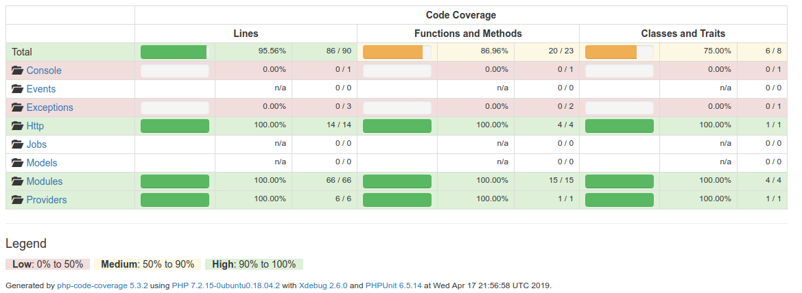

# NHTSA Test API

## Description

This is an example PHP project to request car information from nhtsa.

This project is based on the Lumen framework

## Requirements

The following packages are required by this package

| Package Name | URL | Minimum required version |
| ------------ | --- | ------------------------ |
| PHP | https://www.php.net/ | 7.2+ |
| PHPUnit | https://phpunit.de/ | 6.5.14+ |

Optional packages 

| Package Name | URL | Minimum required version |
| ------------ | --- | ------------------------ |
| Docker | https://www.docker.com/ | latest |
| Docker-Compose | https://docs.docker.com/compose/ | latest |


## <a name="setup"></a> Setup

1. Clone this repository
2. Run `$ cd nhtsa-api-test` (if you used the default project name)
3. Run `$ cd application`
4. Copy the .env.example file to a new file called .env with `$ cp .env.example .env`
5. Configure envinronment variables in `.env` (see [env](#env))
6. Run `$ composer install`
7. Run `$ php artisan key:generate` to generate a new application key in `.env`
8. Run the PHP development server with `$ php -S localhost:8080 -t public` (for docker see [docker](#docker))

### <a name="docker"></a> Alternate steps (Using Docker)

If you prefer to use docker run 1-7 from [setup](#setup) and then go back to the root directory (`$ cd ../`) and run

    docker-compose up


## Tests

Go to the `application` directory using `$ cd application`

Then you can run tests by simply running:

    phpunit

This will run unit and integrations tests (you **must** have the server up and running)

If you only want to run unit tests use:

    phpunit tests/unit

and if you only want to run integration tests:

    phpunit tests/integration

### Coverage



## <a name="env"></a> Env variables

| Environment variable name | Description |
| ------------ | ------------------------ |
| APP_NAME | Name of our application |
| APP_ENV |  Environment name to use |
| APP_KEY |  base64 key generated |
| APP_DEBUG | enable debug mode  |
| APP_TIMEZONE | default timezone  |
| NHTSA_URL | Url to the default NHTSA API defaults to: https://one.nhtsa.gov/webapi/api/SafetyRatings/ |


## Notes

## Improvements

If this was intended to be deployed to production we should:
- Add a cache solution like Redis or memcached to stop requesting the same data to nhtsa over and over again
- Add a Loggin solution to keep all the log information centralized and easy to query if needed.
- Add docker to easily spin up a new environment (adding nginx, php, etc.)
- Add a Swagger documentation and/or postman collection to help the frontend and QA to test and use this API
- Use the kubernetes and terraform to deploy
- Add a load balancer like ElasticBeanstalk or design a solution to allow it to scale to N requests per second.

### Validation
In order to *comply with the requirements*, in case we send `undefined` as some of the parameters we will return an empty response.
Example request: `GET http://localhost:8080/vehicles/undefined/Ford/Fusion`

We should validate the types of the parameters received prior to doing a request to nhtsa. To do this we should go to VehiclesController.php
and update:

```
 const VALIDATION_RULES = [
        'modelYear' => 'required|numeric',
        'manufacturer' => 'required|string',
        'model' => 'required|string',
        'withRating' => 'boolean'
    ];
```


## Resources

Documentation for Lumen can be found on the [Lumen website](https://lumen.laravel.com/docs).

## License

The NCAP Test API is open-sourced software licensed under the [MIT license](https://opensource.org/licenses/MIT).
